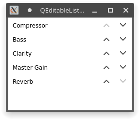

# QEditableListView
ListView for Qt with movable items

Check my other Qt widgets/add-ons out: <https://timschneeberger.me/qt>

### Usage

#### Include it in your project

Copy the `QEditableListView` subdirectory from this repository into your project folder and add this to your qmake project file:

```cmake
include(QEditableListView/QEditableListView.pri)
```

### Screenshot

